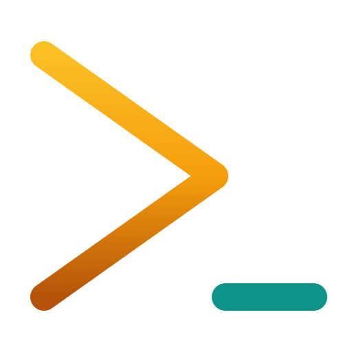

<p align="center">
  
  <h1 align="center">Agent of Empires (AoE)</h1>
  <p align="center">
    <a href="https://github.com/njbrake/agent-of-empires/actions/workflows/ci.yml"></a>
    <a href="https://github.com/njbrake/agent-of-empires/releases"></a>
    <a href="https://formulae.brew.sh/formula/aoe"></a>
    <a href="LICENSE"></a>
    <a href="https://clawhub.ai/njbrake/aoe"></a>
    <br>
    <a href="https://www.youtube.com/@agent-of-empires"></a>
    <a href="https://x.com/natebrake"></a>
  </p>
</p>

A terminal session manager for AI coding agents on Linux and macOS. Built on tmux, written in Rust.

Run multiple AI agents in parallel across different branches of your codebase, each in its own isolated session with optional Docker sandboxing.

> If you find this project useful, please consider giving it a star on GitHub: it helps others discover the project!

[](https://www.youtube.com/watch?v=Kk8dX_F-P4E)

## What This Fork Adds

This fork builds on the original AoE with several quality-of-life improvements for power users managing many agents:

- **Session navigation keybindings** -- `Ctrl+.` / `Ctrl+,` to quick-switch between sessions (cycling across groups), number keys `1`-`99` to jump directly to a session from both the TUI and inside tmux, `Ctrl+b b` to toggle back to the previous session (like vim's `Ctrl+^`). Inside tmux: vi-style pane navigation (`Ctrl+b h/j/k/l`), `Ctrl+;` to cycle panes, `Ctrl+Q` to one-key detach. Together these make hopping between agents feel fluid without returning to the TUI list.

- **Notification bar** -- inspired by Agent Deck, the tmux status bar shows real-time status for all sessions (Running / Waiting / Idle) with status icons. Even while attached to one agent, you can glance at the status bar to see if another session is waiting for input. Combined with quick-switch, jumping over auto-acknowledges the Waiting state.

- **Agent restart** -- press `R` to restart the agent pane in-place without destroying and recreating the session. Useful for agents like Claude Code that need a restart to pick up skill config changes. For Claude Code and Codex, a graceful resume-restart persists a resume token so the conversation can continue from where it left off.

- **Narrow-screen layout** -- on narrow terminals (iPhone portrait, Mac split-screen, small tmux panes), the TUI automatically hides the preview panel and shows only the session list at full width. When attaching to a session with split panes, the agent pane auto-zooms for a usable full-screen view; returning to a wide terminal auto-unzooms. Pane-switch keybindings (`Ctrl+b h/j/k/l`, `Ctrl+;`) are zoom-aware, so switching panes while zoomed re-zooms the target pane seamlessly.

## Features

- **Multi-agent support** -- Claude Code, OpenCode, Mistral Vibe, Codex CLI, Gemini CLI, Cursor CLI, Copilot CLI, and Pi.dev
- **TUI dashboard** -- visual interface to create, monitor, and manage sessions
- **Agent + terminal views** -- toggle between your AI agents and paired shell terminals with `t`
- **Status detection** -- see which agents are running, waiting for input, or idle
- **Git worktrees** -- run parallel agents on different branches of the same repo
- **Docker sandboxing** -- isolate agents in containers with shared auth volumes
- **Diff view** -- review git changes and edit files without leaving the TUI
- **Per-repo config** -- `.aoe/config.toml` for project-specific settings and hooks
- **Profiles** -- separate workspaces for different projects or clients
- **CLI and TUI** -- full functionality from both interfaces

## How It Works

AoE wraps [tmux](https://github.com/tmux/tmux/wiki). Each session is a tmux session, so agents keep running when you close the TUI. Reopen `aoe` and everything is still there.

The key tmux shortcut to know: **`Ctrl+b d`** detaches from a session and returns to the TUI.

## Installation

**Prerequisites:** [tmux](https://github.com/tmux/tmux/wiki) (required), [Docker](https://www.docker.com/) (optional, for sandboxing)

```bash
# Quick install (Linux & macOS)
curl -fsSL \
  https://raw.githubusercontent.com/njbrake/agent-of-empires/main/scripts/install.sh \
  | bash

# Homebrew
brew install aoe

# Nix
nix run github:njbrake/agent-of-empires

# Build from source
git clone https://github.com/njbrake/agent-of-empires
cd agent-of-empires && cargo build --release
```

## Quick Start

```bash
# Launch the TUI
aoe

# Add a session from CLI
aoe add /path/to/project

# Add a session on a new git branch
aoe add . -w feat/my-feature -b

# Add a sandboxed session
aoe add --sandbox .
```

In the TUI: `n` to create a session, `Enter` to attach, `t` to toggle terminal view, `D` for diff view, `d` to delete, `?` for help.

## Documentation

- **[Installation](https://www.agent-of-empires.com/docs/installation)** -- prerequisites and install methods
- **[Quick Start](https://www.agent-of-empires.com/docs/quick-start)** -- first steps and basic usage
- **[Workflow Guide](https://www.agent-of-empires.com/docs/guides/workflow)** -- recommended setup with bare repos and worktrees
- **[Git Worktrees](https://www.agent-of-empires.com/docs/guides/worktrees)** -- parallel agents on different branches
- **[Docker Sandbox](https://www.agent-of-empires.com/docs/guides/sandbox)** -- container isolation for agents
- **[Repo Config & Hooks](https://www.agent-of-empires.com/docs/guides/repo-config)** -- per-project settings and automation
- **[Diff View](https://www.agent-of-empires.com/docs/guides/diff-view)** -- review and edit changes in the TUI
- **[tmux Status Bar](https://www.agent-of-empires.com/docs/guides/tmux-status-bar)** -- integrated session monitoring
- **[Sound Effects](https://www.agent-of-empires.com/docs/sounds)** -- audible agent status notifications
- **[Configuration Reference](https://www.agent-of-empires.com/docs/guides/configuration)** -- all config options
- **[CLI Reference](https://www.agent-of-empires.com/docs/cli/reference)** -- complete command documentation
- **[Development](https://www.agent-of-empires.com/docs/development)** -- contributing and local setup

## FAQ

### What happens when I close aoe?

Nothing. Sessions are tmux sessions running in the background. Open and close `aoe` as often as you like. Sessions only get removed when you explicitly delete them.

### Which AI tools are supported?

Claude Code, OpenCode, Mistral Vibe, Codex CLI, Gemini CLI, Cursor CLI, Copilot CLI, and Pi.dev. AoE auto-detects which are installed on your system.

## Troubleshooting

### Using aoe with mobile SSH clients (Termius, Blink, etc.)

Run `aoe` inside a tmux session when connecting from mobile:

```bash
tmux new-session -s main
aoe
```

Use `Ctrl+b L` to toggle back to `aoe` after attaching to an agent session.

### Claude Code is flickering

This is a known Claude Code issue, not an aoe problem: https://github.com/anthropics/claude-code/issues/1913

## Development

```bash
cargo check          # Type-check
cargo test           # Run tests
cargo fmt            # Format
cargo clippy         # Lint
cargo build --release  # Release build

# Debug logging (writes to debug.log in app data dir)
AGENT_OF_EMPIRES_DEBUG=1 cargo run
```

## Star History

[](https://www.star-history.com/#njbrake/agent-of-empires&type=date&legend=top-left)

## Acknowledgments

Inspired by [agent-deck](https://github.com/asheshgoplani/agent-deck) (Go + Bubble Tea).

## Author

Created by [Nate Brake](https://x.com/natebrake) ([@natebrake](https://x.com/natebrake))

## License

MIT License -- see [LICENSE](LICENSE) for details.
